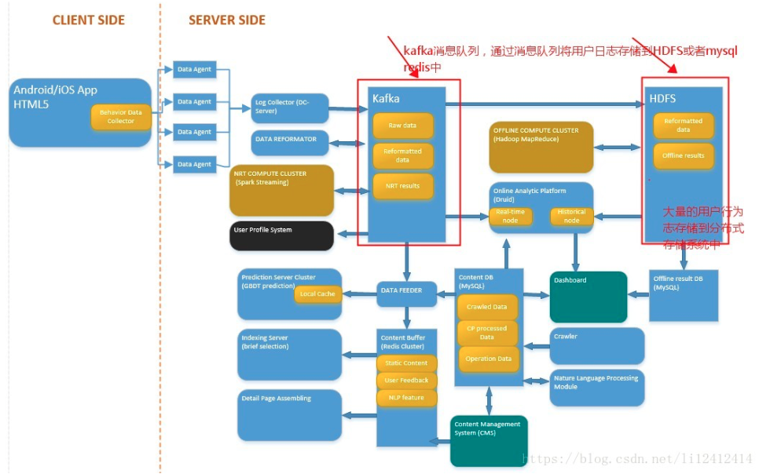
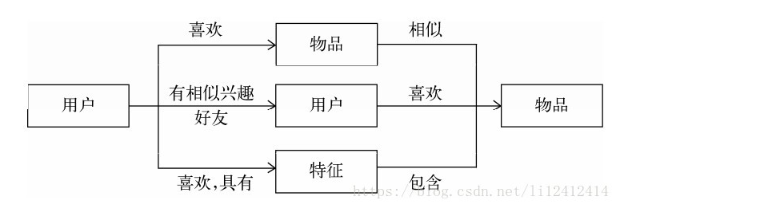

## 一. 利用用户行为数据   

### **1. 什么叫用户行为数据**   
> 在网站或者应用中用户的浏览,购买,点击,评分,评论等行为都是用户行为。
  可以通过用户留下的文字和行为了解用户的兴趣和爱好，改善推荐算法，从而使推荐结果更符合用户口味

### **2. 用户行为的分类**
> 显性反馈行为: 显性反馈行为包括用户明确表示对物品喜好的行为。例如评分或者简单的选择喜欢，或者不喜欢。
> 隐性反馈行为：为指的是那些不能明确反应用户喜好的行为。最具代表性的隐性反馈行为就是页面浏览行为。

|  | 显性反馈 | 隐性反馈   
|-----|-----|-----|  
|视频网站|用户对视频的评分|用户观看视频的日志、浏览视频网页的日志|
|电子商务网站|用户对商品的评分|购买日志、浏览日志|
|门户网站用户对新闻的评分|阅读新闻的日志|
|音乐网站|用户对音乐/歌手/专辑的评分|听歌日志|

### **3. 用户行为的存储**
> 用户行为可以分为显性反馈行为，隐性反馈行为。一般来说，显性反馈行为的数据量会远远小于隐性反馈行为的数据量。
而且比如像相关推荐等，实时性要求是比较高的，或许会导致用户行为的存储方式也不一样。
在<<推荐系统实战>>一书中，对于用户行为的存储给出了如下的一般性意见：

| |显性反馈数据|隐性反馈数据
|-----|-----|-----|
|用户兴趣|明确|不明确|
|数量|较少|庞大|
|存储|数据库|分布式文件系统|
|实时读取|实时|有延迟|
|正负反馈|都有|只有正反馈|

> `所以,可以将用户的行为存储在分布式系统 HDFS 或者数据库,redis 中。
这主要是取决于用户行为数据量的大小以及对实时性的要求是否高。
对于不需要进行实时存储以及分析的行为，我们可以利用Kafka或者Metaq消息队列进行行为的消费，也就是存储。
如下：`   



### **3. 基于用户的协同过滤算法**
> 基于用户的协同过滤算法是推荐系统中最古老的算法。这种算法给用户推荐和他兴趣相似的其他用户喜欢的物品。
比如当一个用户A需要个性化推荐时，可以先找到和他有相似兴趣的其他用户，然后把那些用户喜欢的、而用户A没有听说过的物品。

### **4. 基于物品的协同过滤算法**
> 基于物品的协同过滤算法 这种算法给用户推荐和他之前喜欢的物品相似的物品。
----------
## 二. 利用用户标签数据   

```text
标签是推荐系统中一种重要的特征表现方式。利用好标签，推荐系统可以给用户返回更符合用户个人口味的推荐结果。
``` 

### **1. 为什么用标签**
> 推荐系统的目的是联系用户和物品, 这种联系需要依赖不同的媒介, 目前流行的推荐系统基本上是通过 3 种方式联系用户兴趣和物品,如下图:



> 第一种方式是利用用户喜欢过的物品，给用户推荐与他喜欢过的物品相似的物品，这就是前面提到的基于物品的算法。   
> 第二种方式是利用和用户兴趣相似的其他用户，给用户推荐那些和他们兴趣爱好相似的其他用户喜欢的物品，这是前面提到的基于用户的算法。  
> 第三种重要的方式是通过一些特征（feature）联系用户和物品，给用户推荐那些具有用户喜欢的特征的物品。
这里的特征有不同的表现方式，比如可以表现为物品的属性集合（比如对于图书，属性集合包括作者、出版社、主题和关键词等），
也可以表现为隐语义向量（latent factor vector），这可以通过前面提出的隐语义模型习得到。
**`标签--是一种重要的特征表现形式`**

### **2. 标签的分类**
+ UGC 标签
> 指的是用户为内容打的标签 
+ PGC 标签
> 只得是专家为内容打的标签
---------
## 三. 利用上下文信息
> 准确利用上下文信息(包括时间、地点、心情)对于提升推荐效果有重要作用.
-----

## 四. 利用社交网络数据
> 电子邮件 / 用户注册信息 / 用户的位置数据 / 论坛和讨论组 / 即时聊天工具 / 社交网站
社会图谱（Facebook）和兴趣图谱（Twitter）
